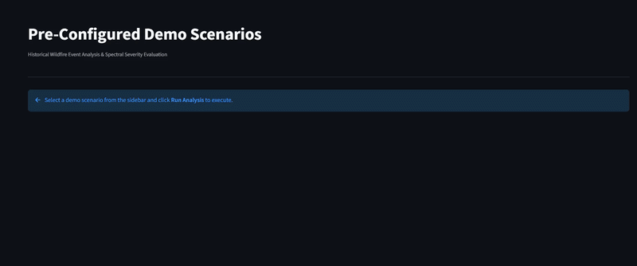
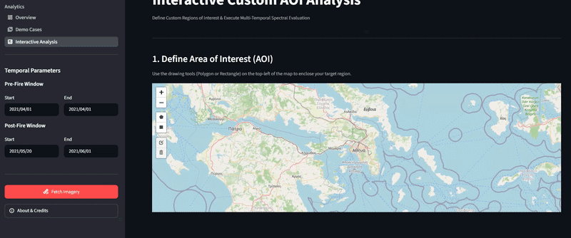
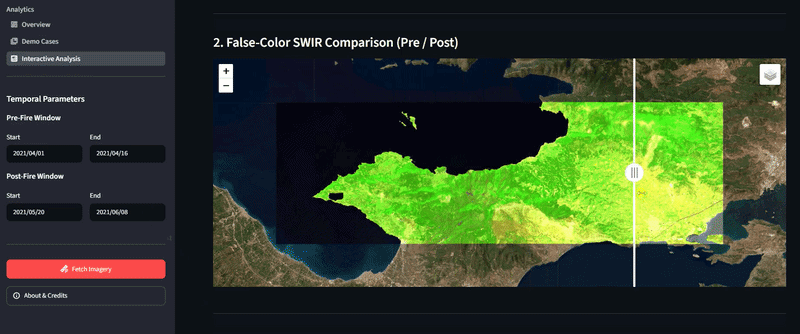

# Wildfire EO Portal

Wildfire severity assessment tool using Sentinel-2 imagery and Google Earth Engine.

[Live app](https://wildfire-eo-app.streamlit.app/)

The dashboard computes burn severity from pre/post-fire Sentinel-2 composites and reports burned area by severity class and land cover type. Built around past wildfire events in Greece, with support for arbitrary custom areas of interest.

## Demo

Pre-configured historical scenarios:



Custom AOI drawing tool:




## Features

- Automated Sentinel-2 L2A retrieval with cloud masking
- dNBR-based burn severity classification
- Burned area statistics by burn severity and land cover (ESA WorldCover)
- Interactive polygon/rectangle drawing for custom AOIs
- Pre-configured scenarios for wildfire events

## Project structure 

```
wildfire-eo-portal/
├── app.py
├── pages/
│ ├── demo_cases.py
│ └── interactive_analysis.py
├── src/
│ ├── data_loader.py
│ ├── indices.py
│ ├── classify.py
│ └── stats.py
├── data/
│ └── demo_scenarios.json
└── assets/
```

## Running locally

```bash
git clone https://github.com/ioannatselka/wildfire-eo-portal.git
cd wildfire-eo-portal
pip install -r requirements.txt
```

Requires a Google Earth Engine account and registered Cloud project. Create `.streamlit/secrets.toml`:

```toml
[earth_engine]
project_id = "your-gee-project-id"
```

```bash
streamlit run app.py
```
